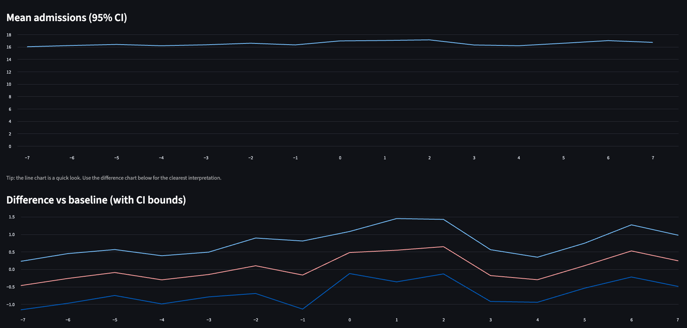
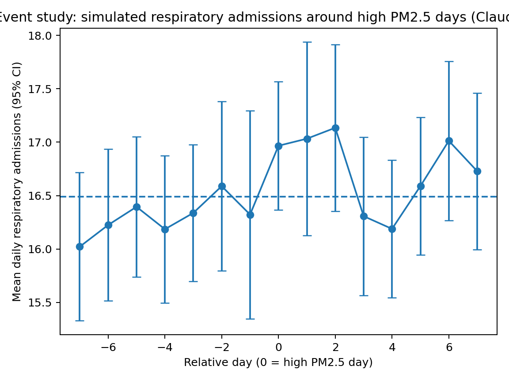
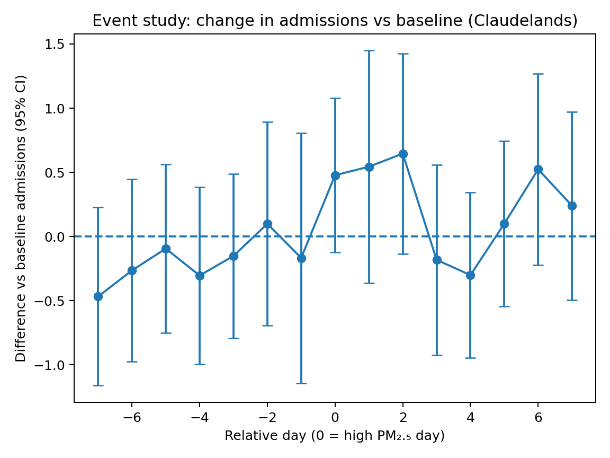

ALAN-C2: PM₂.₅ Exposure and Respiratory Admissions (Event Study)
**Live app:** https://alan-pm25-respiratory-c2-d9cpuzjponbxsubviqpwyv.streamlit.app/

1. Project overview

This project explores whether short-term spikes in fine particulate air pollution (PM₂.₅) are associated with changes in daily respiratory hospital admissions, using an event study design.

The analysis focuses on Claudelands (Waikato) and uses publicly available air-quality data to simulate how respiratory admissions behave before, during, and after high PM₂.₅ exposure days.

Purpose:
Not prediction or causal proof, but to examine whether observed patterns are consistent with known environmental health mechanisms.

### App preview

⸻

2. Research question

Do respiratory admissions increase around days with unusually high PM₂.₅ concentrations, and if so, when does the effect appear?

Specifically:
	•	Is there evidence of a lagged effect (admissions rising 1–2 days after exposure)?
	•	Do admissions return to baseline after the event?
	•	Is there any unusual pattern before high-pollution days?

⸻

3. Data sources
	•	Air quality:
LAWA (Land, Air, Water Aotearoa) daily PM₂.₅ measurements
	•	Location:
Claudelands monitoring site, Waikato
	•	Time span:
October 2017 – December 2024

Hospital admissions in this project are simulated to demonstrate methodology and interpretation.
The pipeline is designed to accept real health data where governance permits.

⸻

4. Key concepts (plain language)

High PM₂.₅ exposure days

A high-exposure day is defined as a day where PM₂.₅ is in the top 10% (90th percentile) of observed values at the site.

This focuses the analysis on unusually polluted days, not everyday variation.

⸻

Event study design

Each high PM₂.₅ day is treated as an “event”.

For every event, we examine a ±7-day window:
	•	Days before the event (−7 to −1)
	•	The event day (0)
	•	Days after the event (+1 to +7)

Admissions are then averaged across all events for each relative day.

This allows us to ask:

“On average, what happens around high-pollution days?”

⸻

Control days (baseline)

All non-event days with valid PM₂.₅ data serve as the baseline.

This represents:

“Typical daily admissions when PM₂.₅ is not unusually high.”

⸻

Confidence intervals (95%)

Error bars in the plots represent 95% confidence intervals, which show the range of plausible values for the true mean.
	•	If an interval crosses the baseline, the effect is uncertain.
	•	If an interval lies mostly above the baseline, it suggests a consistent increase.
	•	Wider intervals reflect greater uncertainty, often due to fewer observations.

⸻

5. Analysis workflow

Step 1: Extract daily PM₂.₅
	•	Load LAWA air-quality data
	•	Standardise dates, site names, and regions
	•	Output: daily PM₂.₅ time series

Step 2: Identify high-exposure days
	•	Calculate the 90th percentile PM₂.₅ threshold
	•	Flag days exceeding this threshold

Step 3: Build a complete daily timeline
	•	Explicitly represent missing PM₂.₅ days
	•	Prevent missing data from biasing control periods

Step 4: Construct event windows
	•	Create ±7-day windows around each high-exposure day
	•	Exclude:
	•	Missing PM₂.₅ days
	•	Other high-exposure days from control periods

Step 5: Summarise event effects
	•	Calculate mean admissions for each relative day
	•	Compare against baseline control days
	•	Estimate confidence intervals

⸻

6. Key findings (simulated data)
	## Key Insights (quick read)

Key insights (quick read)
- **No clear pre-trend:** admissions in days −7 to −1 stay close to baseline.
- **Short-term uplift around exposure:** admissions rise on day 0 and peak around days +1 to +2.
- **Uncertainty is explicit:** 95% confidence intervals show where the signal is strongest vs where results remain compatible with baseline.

### Visual summary

**Mean admissions (with 95% CI)**

**Difference vs baseline (with 95% CI)**

⸻

7. Interpretation and limitations
	•	Results show associations, not causation.
	•	Admissions are simulated for demonstration.
	•	No adjustment for:
	•	Weather
	•	Seasonality
	•	Day-of-week effects
	•	Population mobility

The project is intended as a methodological and interpretive showcase, not a policy conclusion.

⸻

8. Why this project matters

This project demonstrates:
	•	Careful handling of temporal exposure data
	•	Transparent treatment of uncertainty
	•	Use of event study methods in a public-health context
	•	A workflow suitable for real-world health analytics under governance constraints

⸻

9. Next extensions (future work)
	•	Integrate real hospital admission data
	•	Adjust for confounders (weather, seasonality)
	•	Stratify by age or vulnerability groups
	•	Extend to multiple monitoring sites
	•	Deploy interactive visualisation (Streamlit)

⸻

10. Author

Vivek Raghunathan
Health sector data analyst / aspiring data scientist
Aotearoa New Zealand